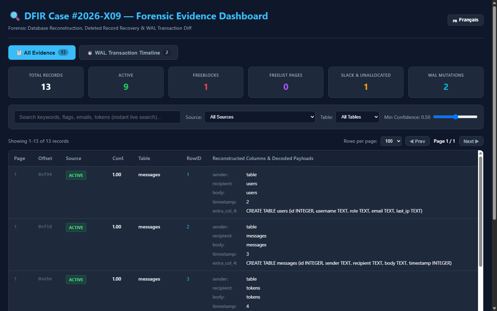
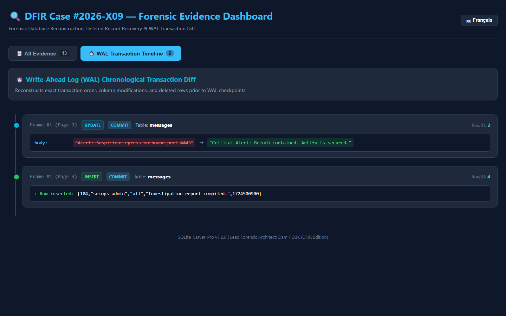

# SQLite-Carver-Pro 🔍

[](https://www.python.org/downloads/)
[](https://opensource.org/licenses/MIT)
[]()
[]()

**SQLite-Carver-Pro v1.2.0** is an offline digital forensics parser and analysis toolkit engineered to inspect B-Tree structures, carve deleted records from slack space & freeblocks, reassemble overflow chains, compute WAL transaction differential timelines, and decode embedded binary structures (`bplist`, `protobuf`, `zlib`).

---

## ⚠️ Important Verification Notice & Disclaimer

> **Forensic Analysis Advisory**:
> Binary carving and slack space recovery utilize heuristic pattern recognition to reconstruct partially overwritten or unreferenced database cells. As with any data recovery or forensic analysis tool, **all carved artifacts, timestamps, and reconstructed rows must be independently verified, corroborated, and cross-referenced** with complementary system logs or primary sources before reaching definitive analytical, investigative, or legal conclusions. The software is provided "as is", without warranty of any kind.

---

## 📑 Documentation & Reference Guides

- 🇬🇧 **[Complete English Forensic Guide (PDF)](./SQLite_Carver_Pro_Forensic_Guide_v1.2.0_EN.pdf)** — Technical reference manual, mathematical score formulas, and CLI guides.
- 🇫🇷 **[Guide Forensique Intégral (PDF)](./Guide_Forensique_SQLite_Carver_Pro_v1.2.0_FR.pdf)** — Manuel de référence complet avec schémas d'architecture B-Tree et barème de scoring.

---

## 📑 Table of Contents

1. [Important Verification Notice & Disclaimer](#️-important-verification-notice--disclaimer)
2. [Core Features](#-core-features)
3. [Interactive HTML Dashboard Preview](#-interactive-html-dashboard-preview)
4. [Architecture Overview](#-architecture-overview)
5. [Installation & Standalone Binary](#-installation--standalone-binary)
6. [CLI Usage Guide & Previews](#-cli-usage-guide--previews)
   - [1. Database Inspection (`info`)](#1-database-inspection-info)
   - [2. Forensic Deleted Record Carving (`carve`)](#2-forensic-deleted-record-carving-carve)
   - [3. Deep Forensic Search (`search`)](#3-deep-forensic-search-search)
   - [4. WAL Transaction Diffing & Timeline (`wal-diff`)](#4-wal-transaction-diffing--timeline-wal-diff)
   - [5. Embedded BLOB Microscope (`decode-blob`)](#5-embedded-blob-microscope-decode-blob)
7. [Supported Export Formats](#-supported-export-formats)
8. [Python API Quickstart](#-python-api-quickstart)
9. [Automated Test Suite](#-automated-test-suite)
10. [Author & Credits](#-author--credits)

---

## 🚀 Core Features

- **Low-Level B-Tree Parsing**: Full dissection of 100-byte database headers, Table Leaf (`0x0D`), Table Interior (`0x05`), Index Leaf (`0x0A`), and Index Interior (`0x02`) pages.
- **Deleted Record Carving**: Recovers deleted cells from **Cell Slack Space**, **Freeblocks** (linked lists), and **Unallocated Page Margins** with heuristic schema matching.
- **Overflow Reassembly**: Transparently chains 4-byte overflow pointers across multi-page payloads.
- **WAL Diff Engine**: Parses Write-Ahead Log frames to reconstruct row-level `INSERT`, `UPDATE` (with before/after diffs), and `DELETE` mutations.
- **Embedded Binary Decoders**:
  - **Apple Binary Plist (`bplist00`)**: Parses dictionaries, arrays, UIDs, and timestamps.
  - **Google Protocol Buffers (`protobuf`)**: Dynamic wire parser without `.proto` definitions (strict false-positive elimination).
  - **Compression**: Automatic detection and extraction of `zlib`/`deflate` streams.
- **Dual-Language Support**: Native CLI localization (`--lang en` / `--lang fr`) and one-click language switcher inside the HTML report.
- **Zero-Dependency Standalone Binary**: 100% portable `.exe` running out-of-the-box on clean, air-gapped forensic workstations.

---

## 🖥 Interactive HTML Dashboard Preview

When exporting with `--export report.html`, `sqlite-carver-pro` generates a **100% Standalone Air-Gapped Web Application** featuring live instant search, confidence slider, 60 FPS pagination, and a one-click bilingual toggle (🇬🇧 English / 🇫🇷 Français):

### 📋 All Evidence & Carved Records View


### ⏱️ WAL Transaction Timeline & Diff View


---

## 🏛 Architecture Overview

```
sqlite-carver-pro/
├── sqlite_carver/
│   ├── core/
│   │   ├── varint.py        # SQLite Varint & Serial Type Codec
│   │   ├── parser.py        # Header, B-Tree Page, Cell, Overflow & Freelist Parser
│   │   ├── carver.py        # Deleted Record Carver, Schema Matcher & Heuristics
│   │   ├── search.py        # Recursive Multi-Container Forensic Search Engine
│   │   └── wal_diff.py      # WAL & Rollback Journal Frame Parser & Timeline Engine
│   ├── decoders/
│   │   └── blobs.py         # Apple bplist, Protobuf wire parser, zlib decompressors
│   ├── exporters/
│   │   ├── export.py        # Unified Export Router (HTML, JSON, JSONL, CSV, Parquet)
│   │   └── html_report.py   # Dual-View Interactive Web Application (60 FPS Pagination)
│   ├── i18n.py              # Internationalization Engine (English & French)
│   ├── cli.py               # Rich CLI with Colorized Outputs and Progress
│   └── __init__.py          # Unified Python Forensics API
├── dist/
│   └── sqlite-carver-v1.2.0.exe  # Standalone Air-Gapped Binary (Windows 64-bit)
└── tests/
    └── ...                  # 26 Automated Test Suites (100% Pass)
```

---

## 📦 Installation & Standalone Binary

### Option A: Direct Standalone Binary (Zero Python Required)
Download `sqlite-carver-v1.2.0.exe` directly from the [`dist/`](./dist/sqlite-carver-v1.2.0.exe) directory or GitHub Releases.

```powershell
# Check version
.\sqlite-carver-v1.2.0.exe --version
```

### Option B: Python Package Installation
```bash
# Clone the repository
git clone https://github.com/Dam-FOR3K/sqlite-carver-pro.git
cd sqlite-carver-pro

# Install in editable mode
pip install -e .

# Or install with parquet support
pip install -e ".[parquet]"
```

---

## 🖥 CLI Usage Guide & Previews

### 1. Database Inspection (`info`)
Inspect database header flags, page allocation metrics, freelist trunk chains, and discovered schemas:

```bash
# English interface (default)
sqlite-carver info evidence.db

# French interface
sqlite-carver info evidence.db --lang fr
```

**Terminal Output Preview:**
```
╔════════════════════════════════════════════════════════════════╗
║             SQLite-Carver-Pro v1.2.0                           ║
║  Forensic Parser, Slack Carver, Freelist & WAL Diff Engine     ║
╚════════════════════════════════════════════════════════════════╝
╭─────────────────────── SQLite Database Header Analysis ────────────────────────╮
│ Page Size               4096 bytes                                             │
│ Page Count              48 pages (196,608 bytes)                               │
│ File Format Version     Read: 2, Write: 2 (WAL Mode)                           │
│ Text Encoding           UTF-8 (1)                                              │
│ Freelist Pages          3 (Trunk Root Page: 6)                                 │
│ Schema Cookie / Version 4 / user_version: 0                                    │
│ Application ID          0x00000000                                             │
╰────────────────────────────────────────────────────────────────────────────────╯
Found 3 Freelist Page(s): [6, 7, 5]

Discovered Schema Tables:
┏━━━━━━━━━━━━━━┳━━━━━━━━━━━┳━━━━━━━━━━━━━━━━━━━━━━━━━━━━━━━━┳━━━━━━━━━━━━━━━━━━┓
┃ Table Name   ┃ Root Page ┃ Columns                        ┃ SQL Definition   ┃
┡━━━━━━━━━━━━━━╇━━━━━━━━━━━╇━━━━━━━━━━━━━━━━━━━━━━━━━━━━━━━━╇━━━━━━━━━━━━━━━━━━┩
│ users        │         2 │ id: INTEGER, name: TEXT...     │ CREATE TABLE...  │
│ messages     │         3 │ id: INTEGER, body: TEXT...     │ CREATE TABLE...  │
└──────────────┴───────────┴────────────────────────────────┴──────────────────┘
```

---

### 2. Forensic Deleted Record Carving (`carve`)
Carve active cells, freeblock remnants, unallocated page margins, and cell slack:

```bash
# 1. Carve all records (active + deleted + companion WAL journal)
sqlite-carver carve evidence.db

# 2. Isolate ONLY carved deleted records
sqlite-carver carve evidence.db --deleted-only

# 3. Filter by table and strict confidence threshold
sqlite-carver carve evidence.db --table messages --min-confidence 0.80

# 4. Generate the full interactive web report
sqlite-carver carve evidence.db --export forensic_report.html
```

---

### 3. Deep Forensic Search (`search`)
Recursively search for text keywords or hex signatures across **active records, deleted freeblocks, slack space, WAL transactions, and embedded payloads (`bplist`, `protobuf`, `zlib`)**:

```bash
# 1. Search text token across database and WAL journal
sqlite-carver search evidence.db "session_token_xyz"

# 2. Search hex pattern inside binary BLOB fields
sqlite-carver search evidence.db "deadbeef" --hex

# 3. Target deleted records only
sqlite-carver search evidence.db "malware" --deleted-only

# 4. Export search matches to spreadsheet or JSON
sqlite-carver search evidence.db "admin" --export matches.csv
```

---

### 4. WAL Transaction Diffing & Timeline (`wal-diff`)
Reconstruct chronological transaction mutations across Write-Ahead Log frames:

```bash
# Analyze WAL transaction timeline
sqlite-carver wal-diff evidence.db evidence.db-wal

# Target a specific table and export timeline
sqlite-carver wal-diff evidence.db evidence.db-wal --table users --export wal_diff.html
```

---

### 5. Embedded BLOB Microscope (`decode-blob`)
Directly inspect and decode embedded binary structures:

```bash
# Inspect hex string
sqlite-carver decode-blob --hex 62706c6973743030d3010203...

# Inspect raw binary file
sqlite-carver decode-blob --file extracted_payload.bin
```

---

## 📊 Supported Export Formats

| Format | Extension | Key Capabilities |
|---|---|---|
| **Interactive HTML Report** | `.html` | Dual-view web app, 60 FPS pagination, live search, WAL timeline tab, language toggle. |
| **Indented JSON** | `.json` | Full hierarchical representation formatted for text editors. |
| **JSON Lines** | `.jsonl` | Single-line JSON streaming format for SIEM ingestion (Splunk, ElasticSearch). |
| **Excel CSV** | `.csv` | Tabular spreadsheet with detailed forensic provenance column. |
| **Apache Parquet** | `.parquet` | High-performance compressed columnar data for Polars, DuckDB, Pandas. |

---

## 🐍 Python API Quickstart

```python
from pathlib import Path
from sqlite_carver import SQLiteCarver, WalDiffEngine, ForensicSearchEngine, export_html

# 1. Programmatic Carving
raw_db = Path("evidence.db").read_bytes()
carver = SQLiteCarver(raw_db)

records = [r for r in carver.carve_all() if r.confidence >= 0.80]
for r in records:
    if r.source != "active":
        print(f"[{r.source.upper()}] Page {r.page_id} | Table: {r.matched_table} | Conf: {r.confidence:.2f}")

# 2. Recursive Evidence Search
engine = ForensicSearchEngine(raw_db)
matches = engine.search("session_token_xyz")
print(f"Found {len(matches)} token occurrences across database and BLOBs!")

# 3. Export Interactive HTML Report
export_html(records, "automated_report.html")
```

---

## 🧪 Automated Test Suite

```bash
python -m pytest tests/ -v
```

```
============================= test session starts =============================
platform win32 -- Python 3.14.2, pytest-9.0.2, pluggy-1.6.0
collected 26 items

tests/test_blobs.py::test_apple_binary_plist PASSED                      [  3%]
tests/test_blobs.py::test_protobuf_dynamic_wire_parser PASSED            [  7%]
tests/test_blobs.py::test_zlib_compressed_stream PASSED                  [ 11%]
tests/test_blobs.py::test_inspect_blob_router PASSED                     [ 15%]
tests/test_blobs.py::test_protobuf_false_positive_rejection PASSED       [ 19%]
tests/test_carver.py::test_table_schema_from_sql PASSED                  [ 23%]
tests/test_carver.py::test_schema_matching PASSED                        [ 26%]
tests/test_carver.py::test_carve_real_sqlite_deleted_records PASSED      [ 30%]
tests/test_cli.py::test_exporters PASSED                                 [ 34%]
tests/test_parser.py::test_database_header_parsing PASSED                [ 38%]
tests/test_parser.py::test_page_header_parsing PASSED                    [ 42%]
tests/test_parser.py::test_decode_record_payload PASSED                  [ 46%]
tests/test_parser.py::test_overflow_reassembly PASSED                    [ 50%]
tests/test_parser.py::test_freelist_traversal PASSED                     [ 53%]
tests/test_search.py::test_recursive_search_in_data_primitives PASSED    [ 57%]
tests/test_search.py::test_recursive_search_in_bplist_and_hex PASSED     [ 61%]
tests/test_search.py::test_forensic_search_engine_active_and_deleted PASSED [ 65%]
tests/test_varint.py::test_single_byte_varint PASSED                     [ 69%]
tests/test_varint.py::test_multi_byte_varint PASSED                      [ 73%]
tests/test_varint.py::test_nine_byte_varint PASSED                       [ 76%]
tests/test_varint.py::test_truncated_varint PASSED                       [ 80%]
tests/test_varint.py::test_serial_type_lengths PASSED                    [ 84%]
tests/test_varint.py::test_decode_serial_values PASSED                   [ 88%]
tests/test_varint.py::test_truncated_serial_value PASSED                 [ 92%]
tests/test_wal_diff.py::test_wal_header_parsing PASSED                   [ 96%]
tests/test_wal_diff.py::test_wal_diff_end_to_end PASSED                  [100%]

============================= 26 passed in 0.55s ==============================
```

---

## 👤 Author & Credits

- **Author & Design :** **Dam-FOR3K**
- **Technical & Systems Engineering :** Antigravity AI (Google DeepMind)

---

## 📜 License

This project is licensed under the **MIT License**. See the [`LICENSE`](./LICENSE) file for details.
