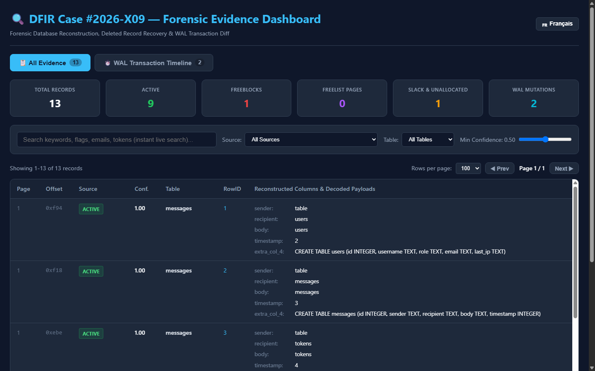
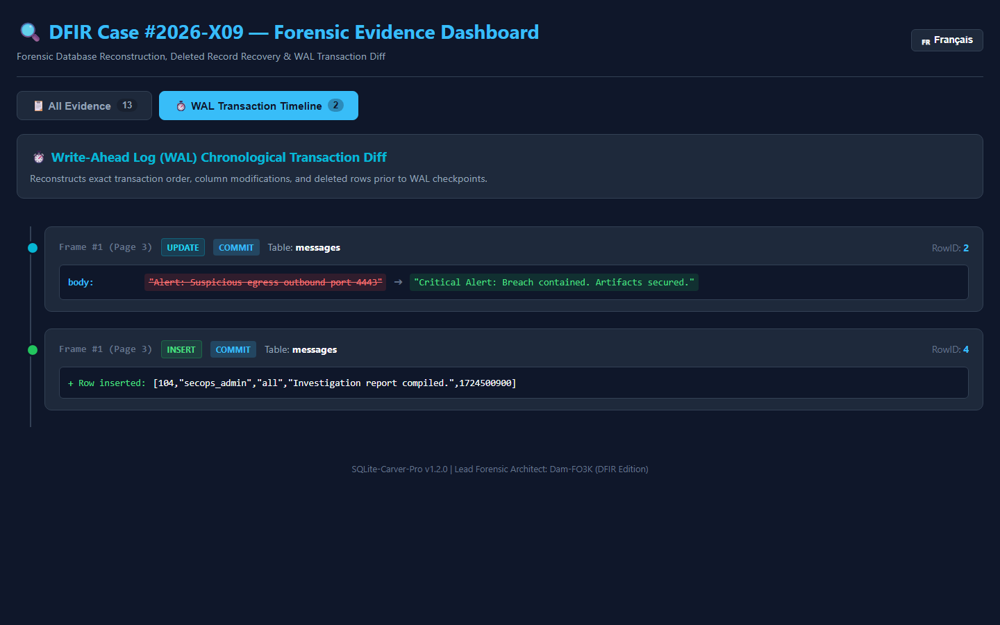

# SQLite-Carver-Pro 🔍

[](https://www.python.org/downloads/)
[](https://opensource.org/licenses/MIT)
[]()
[]()

**SQLite-Carver-Pro v1.9.1** is an offline digital forensics parser and analysis toolkit engineered to inspect B-Tree structures directly at the binary page level, carve deleted records from table and index pages (`0x0A`, `0x02`), resurrect deleted records via cross-index correlation (`resurrected_from_index`), handle R-Tree and FTS virtual tables natively, decode `WITHOUT ROWID` architectures, resurrect dropped tables (`DROP TABLE`) from Page 1 unallocated space, track intelligent record mutations and modifications (`--mutations-only`), decrypt SQLCipher (v3/v4 AES-256-CBC) and SQLite Encryption Extension (SEE AES-OFB) databases on-the-fly (`--key`), transparently decrypt WAL frame payloads, carve superseded WAL frames past checkpoints (WAL Slack Space), reconstruct multi-version page histories, detect anti-forensic `PRAGMA secure_delete` wiping, provide an interactive modern Dark-Mode Desktop GUI (`sqlite-carver gui`), inspect raw forensic byte payloads via interactive Hex/ASCII modals, render interactive database topology & Mermaid.js ER diagrams, hunt raw B-Tree pages from memory dumps/disk images with multi-core parallel processing (`carve-raw --workers`), analyze WAL shared memory (`.db-shm`), decode multi-format timestamps and GPS coordinates, audit physical page reserved areas (anti-forensics/steganography), guarantee cryptographic chain of custody, carve embedded file BLOBs, and decode nested binary structures (`bplist`, `protobuf`, `zlib`).

---

## ⚠️ Important Verification Notice & Disclaimer

> **Forensic Analysis Advisory**:
> Binary carving and slack space recovery utilize heuristic pattern recognition to reconstruct partially overwritten or unreferenced database cells. As with any data recovery or forensic analysis tool, **all carved artifacts, timestamps, coordinates, and reconstructed rows must be independently verified, corroborated, and cross-referenced** with complementary system logs or primary sources before reaching definitive analytical, investigative, or legal conclusions. The software is provided "as is", without warranty of any kind.

---

## 📑 Documentation & Reference Guides

- 🇬🇧 **[Complete English Forensic Guide (PDF)](./SQLite_Carver_Pro_Forensic_Guide_v1.9.1_EN.pdf)** — Technical reference manual, mathematical score formulas, physical B-Tree internals, mutation diffing, and CLI guides.
- 🇫🇷 **[Guide Forensique Intégral (PDF)](./Guide_Forensique_SQLite_Carver_Pro_v1.9.1_FR.pdf)** — Manuel de référence complet avec anatomie physique des B-Trees, rétro-ingénierie forensique du slack, analyse de mutations et barème de scoring.

---

## 📑 Table of Contents

1. [Important Verification Notice & Disclaimer](#️-important-verification-notice--disclaimer)
2. [Core Features](#-core-features)
3. [Interactive HTML Dashboard & ER Topology](#-interactive-html-dashboard--er-topology)
4. [Modern Desktop GUI Application](#-modern-desktop-gui-application)
5. [Architecture Overview](#-architecture-overview)
6. [Installation & Standalone Binary](#-installation--standalone-binary)
7. [CLI Usage Guide & Previews](#-cli-usage-guide--previews)
   - [0. Interactive Modern GUI (`gui`)](#0-interactive-modern-gui-gui)
   - [1. Database Inspection (`info`)](#1-database-inspection-info)
   - [2. Forensic Deleted Record Carving (`carve`)](#2-forensic-deleted-record-carving-carve)
   - [3. Deep Forensic Search (`search`)](#3-deep-forensic-search-search)
   - [4. WAL Transaction Diffing & Timeline (`wal-diff`)](#4-wal-transaction-diffing--timeline-wal-diff)
   - [5. Embedded BLOB Microscope (`decode-blob`)](#5-embedded-blob-microscope-decode-blob)
   - [6. Raw Page Hunter (`carve-raw`)](#6-raw-page-hunter-carve-raw)
8. [Supported Export Formats](#-supported-export-formats)
9. [Python API Quickstart](#-python-api-quickstart)
10. [Automated Test Suite](#-automated-test-suite)
11. [Author & Credits](#-author--credits)

---

## 🚀 Core Features

- **Modern Interactive Desktop GUI (`sqlite-carver gui`)**: High-DPI dark graphite desktop dashboard built with CustomTkinter. Non-blocking multi-threaded carving engine, live forensic metric cards, instant multi-criteria search, table/source filtering, embedded Hex Inspector dialog, and on-the-fly SQLCipher credential entry.
- **Forensic Hex & ASCII Payload Inspector Modal**: Interactive byte-level inspector available in both Desktop GUI and standalone HTML reports. Formatted 16 bytes/line with hex offsets, ASCII translation column, one-click "Copy Hex", "Copy ASCII", and direct `.bin` raw payload file download.
- **Database Topology & Mermaid.js ER Diagram**: Dedicated schema analysis tab reconstructing table structures, primary keys, and foreign key relations (`EntityCorrelator`) with interactive table cards and exportable Mermaid.js entity-relationship code.
- **Cross-Index-to-Table Record Resurrection**: Resurrects deleted table records by joining surviving index entries across multiple indices, merging partial column sets into a unified record (`source="resurrected_from_index"`, confidence 0.92) even when the table cell has been completely purged.
- **On-the-Fly SQLCipher Decryption Engine (`--key`)**: Automatically fingerprints encrypted databases, derives AES-256 keys via PBKDF2-HMAC-SHA512 (v4) or SHA1 (v3), and decrypts database pages in-memory before carving without writing plaintext to disk. Supports both passphrases and raw 64-char hex keys.
- **Low-Level B-Tree Parsing**: Full dissection of 100-byte database headers, Table Leaf (`0x0D`), Table Interior (`0x05`), Index Leaf (`0x0A`), and Index Interior (`0x02`) pages.
- **Intelligent Record Mutation Tracking**: Correlates active and carved historical records sharing the same primary key / rowid to produce an immutable timeline of modifications. Computes field-level granular diffs (`old_value` ➔ `new_value`) and allows isolating altered rows with `--mutations-only`.
- **Shannon Entropy & SQLCipher / Encryption Assessment**: Computes overall and page-by-page Shannon entropy ($H \in [0, 8]$) to instantly detect encrypted databases (SQLCipher, SEE, wxSQLite3) with high entropy ($\approx 7.95 - 8.00$) or identify hidden encrypted blocks.
- **Deleted Record Carving**: Recovers deleted cells from **Cell Slack Space**, **Freeblocks** (linked lists), and **Unallocated Page Margins** with heuristic schema matching.
- **Index-Assisted Carving (`0x0A` & `0x02`)**: Extracts indexed column values and target rowids from active, freeblock, and unallocated slack space within index B-trees—allowing partial recovery even when table records have been completely overwritten.
- **Multi-Core Parallel Raw Page Hunter (`carve-raw --workers`)**: High-throughput carving of arbitrary binary streams (RAM dumps, unallocated `.raw` / `.dd` disk images) across all CPU cores without requiring a database header.
- **WAL Shared Memory Analyzer (`.db-shm`)**: Decodes the 48-byte WAL index header, change counters, reader lock slots 0–7, and active WAL frames to inspect concurrent database locks and checkpoints.
- **Cryptographic Chain of Custody & Evidence Hashes**: Automatic SHA-256 and MD5 hashing of primary database and companion files (`.db-wal`, `.db-journal`, `.db-shm`), coupled with deterministic per-record SHA-256 evidence integrity hashes.
- **Geolocation & GPS Coordinate Decoder**: Heuristically extracts standard float and mobile integer micro-degree latitude/longitude coordinates, validating bounds and generating direct clickable OpenStreetMap links.
- **Overflow Reassembly**: Transparently chains 4-byte overflow pointers across multi-page payloads.
- **Multi-Format Forensic Timestamp Engine**: Automatic decoding and UTC normalization of Unix Epoch (s, ms, µs), WebKit/Chrome/Safari (µs since 1601), Windows FILETIME (100ns since 1601), Apple Cocoa Absolute Time (seconds since 2001), and GPS Time.
- **BLOB File Signature Carving**: Heuristic magic byte identification and automated extraction of embedded PNG, JPEG, GIF, PDF, ZIP, GZIP, SQLite databases, TIFF, and WebP files (`--dump-blobs`).
- **WAL-Only Table Isolation**: Identifies ephemeral or uncommitted tables created exclusively inside Write-Ahead Log frames (`[★ WAL-ONLY TABLE]`).
- **WAL Diff Engine**: Parses Write-Ahead Log frames to reconstruct row-level `INSERT`, `UPDATE` (with before/after diffs), and `DELETE` mutations.
- **Embedded Binary Decoders**:
  - **Apple Binary Plist (`bplist00`)**: Parses dictionaries, arrays, UIDs, and timestamps.
  - **Google Protocol Buffers (`protobuf`)**: Dynamic wire parser without `.proto` definitions (strict false-positive elimination).
  - **Compression**: Automatic detection and extraction of `zlib`/`deflate` streams.
- **Dual-Language Support**: Native CLI localization (`--lang en` / `--lang fr`) and one-click language switcher inside the HTML report.
- **Zero-Dependency Standalone Binary**: 100% portable `.exe` running out-of-the-box on clean, air-gapped forensic workstations.

---

## 🖥 Interactive HTML Dashboard Preview

When exporting with `--export report.html`, `sqlite-carver-pro` generates a **100% Standalone Air-Gapped Web Application** featuring live instant search, confidence slider, 60 FPS pagination, decoded timestamp badges, GPS geolocation badges with interactive map links, SHA-256 evidence hashes, companion file integrity cards, and a one-click bilingual toggle (🇬🇧 English / 🇫🇷 Français):

### 📋 All Evidence & Carved Records View


### ⏱️ WAL Transaction Timeline & Diff View


---

## 🏛 Architecture Overview

```
sqlite-carver-pro/
├── sqlite_carver/
│   ├── core/
│   │   ├── varint.py        # SQLite Varint & Serial Type Codec
│   │   ├── parser.py        # Header, B-Tree Page, Cell, Overflow & Freelist Parser
│   │   ├── carver.py        # Deleted Record Carver, Schema Matcher, Index Carving & Multi-Core Hunter
│   │   ├── mutations.py     # Record Mutation Correlator, Field-Level Diffs & Audit Engine
│   │   ├── encryption.py    # Shannon Entropy Calculator & SQLCipher/SEE Detection
│   │   ├── search.py        # Recursive Multi-Container Forensic Search Engine
│   │   ├── wal_diff.py      # WAL & Rollback Journal Frame Parser, Timeline & WAL-Only Table Engine
│   │   ├── shm.py           # WAL Shared Memory (.db-shm) Analyzer & Reader Lock Inspector
│   │   └── integrity.py     # SHA-256 & MD5 Chain of Custody & Deterministic Evidence Hasher
│   ├── decoders/
│   │   ├── blobs.py         # Apple bplist, Protobuf wire parser, zlib, File Signatures & BLOB Dumper
│   │   ├── timestamps.py    # Multi-Format Forensic Timestamp Engine (Unix, WebKit, FILETIME, Cocoa, GPS)
│   │   └── geolocation.py   # GPS & Coordinates Decoder (WGS84, Microdegrees, OpenStreetMap)
│   ├── exporters/
│   │   ├── export.py        # Unified Export Router (HTML, JSON, JSONL, CSV, Parquet, SQLite)
│   │   └── html_report.py   # Dual-View Interactive Web Application (Mutations View, 60 FPS Pagination, Badges)
│   ├── i18n.py              # Internationalization Engine (English & French)
│   ├── cli.py               # Rich CLI with Colorized Outputs, Timestamps, Hashes, SHM & Blob Dumper
│   └── __init__.py          # Unified Python Forensics API
├── dist/
│   └── sqlite-carver-v1.7.0.exe  # Standalone Air-Gapped Binary (Windows 64-bit)
└── tests/
    └── ...                  # 78 Automated Test Suites (100% Pass)
```

---

## 📦 Installation & Standalone Binary

### Option A: Direct Standalone Binary (Zero Python Required)
Download `sqlite-carver-v1.7.0.exe` directly from the [`dist/`](./dist/sqlite-carver-v1.7.0.exe) directory or GitHub Releases.

```powershell
# Check version
.\sqlite-carver.exe --version
```

### Option B: Python Package Installation
```bash
# Clone the repository
git clone https://github.com/Dam-FOR3K/sqlite-carver-pro.git
cd sqlite-carver-pro

# Install in editable mode with GUI and SQLCipher crypto support
pip install -e ".[all]"
```

---

## 🖥 CLI Usage Guide & Previews

### 0. Interactive Modern GUI (`gui`)
Launch the high-DPI dark-mode desktop GUI dashboard with real-time carving, KPI metric cards, and Hex inspector:

```bash
# 1. Launch standalone GUI dashboard
sqlite-carver gui

# 2. Launch GUI with immediate database preloading
sqlite-carver gui evidence.db

# 3. Launch GUI and decrypt SQLCipher database on-the-fly
sqlite-carver gui encrypted_database.db --key "MySecretPassphrase"
```

---

### 1. Database Inspection (`info`)
Inspect database header flags, page allocation metrics, freelist trunk chains, and discovered schemas:

```bash
# English interface (default)
sqlite-carver info evidence.db

# Decrypt SQLCipher container on-the-fly
sqlite-carver info encrypted.db --key "MasterKey123"

# French interface
sqlite-carver info evidence.db --lang fr
```

**Terminal Output Preview:**
```
╔════════════════════════════════════════════════════════════════╗
║             SQLite-Carver-Pro v1.9.1                           ║
║  Forensic Parser, Slack Carver, Freelist & WAL Diff Engine     ║
╚════════════════════════════════════════════════════════════════╝
╭─────────────────────── SQLite Database Header Analysis ────────────────────────╮
│ Page Size               4096 bytes                                             │
│ Page Count              48 pages (196,608 bytes)                               │
│ File Format Version     Read: 2, Write: 2 (WAL Mode)                           │
│ Text Encoding           UTF-8 (1)                                              │
│ Freelist Pages          3 (Trunk Root Page: 6)                                 │
│ Schema Cookie / Version 4 / user_version: 0                                    │
│ Application ID          0x00000000                                             │
╰────────────────────────────────────────────────────────────────────────────────╯
[bold green]Cryptographic Chain of Custody & File Hashes[/bold green]:
  • Database File (evidence.db):
    SHA-256 : 3b9f...
    MD5     : a1c4...
  • WAL Index / Shared Memory File (evidence.db-shm):
    Version : 3007000 (WAL index version 3007000)
    Max WAL Frame : 42 | Checkpoint Sequence : 1
    Reader Locks : Slot 0 -> Frame 42 (PID: 1042)
[bold cyan]Shannon Entropy & Encryption Assessment[/bold cyan]:
  • Overall Database Entropy: 4.82 bits/byte (Unencrypted standard SQLite)
  • Encryption Assessment   : PLAINTEXT (0.00% high-entropy pages)
Found 3 Freelist Page(s): [6, 7, 5]

Discovered Schema Tables:
┏━━━━━━━━━━━━━━┳━━━━━━━━━━━┳━━━━━━━━━━━━━━━━━━━━━━━━━━━━━━━━┳━━━━━━━━━━━━━━━━━━┓
┃ Table Name   ┃ Root Page ┃ Columns                        ┃ SQL Definition   ┃
┡━━━━━━━━━━━━━━╇━━━━━━━━━━━╇━━━━━━━━━━━━━━━━━━━━━━━━━━━━━━━━╇━━━━━━━━━━━━━━━━━━┩
│ users        │         2 │ id: INTEGER, name: TEXT...     │ CREATE TABLE...  │
│ messages     │         3 │ id: INTEGER, body: TEXT...     │ CREATE TABLE...  │
└──────────────┴───────────┴────────────────────────────────┴──────────────────┘
```

---

### 2. Forensic Deleted Record Carving (`carve`)
Carve active cells, freeblock remnants, unallocated page margins, cell slack, index B-trees, companion WAL journals, and track row modifications:

```bash
# 1. Carve all records with automatic embedded file BLOB extraction
sqlite-carver carve evidence.db --dump-blobs ./extracted_blobs

# 2. Isolate ONLY records that underwent mutations/modifications
sqlite-carver carve evidence.db --mutations-only

# 3. Isolate ONLY carved deleted records (including index remnants)
sqlite-carver carve evidence.db --deleted-only

# 4. Filter by table and strict confidence threshold
sqlite-carver carve evidence.db --table messages --min-confidence 0.80

# 5. Generate the full interactive web report with mutation diffs, decoded timestamp badges and geo links
sqlite-carver carve evidence.db --export forensic_report.html
```

---

### 3. Deep Forensic Search (`search`)
Recursively search for text keywords or hex signatures across **active records, deleted freeblocks, slack space, WAL transactions, and embedded payloads (`bplist`, `protobuf`, `zlib`, files)**:

```bash
# 1. Search text token across database and WAL journal, dumping any discovered BLOBs
sqlite-carver search evidence.db "session_token_xyz" --dump-blobs ./carved_evidence

# 2. Search hex pattern inside binary BLOB fields
sqlite-carver search evidence.db "deadbeef" --hex

# 3. Target deleted records only
sqlite-carver search evidence.db "malware" --deleted-only

# 4. Export search matches to spreadsheet or JSON
sqlite-carver search evidence.db "admin" --export matches.csv
```

---

### 4. WAL Transaction Diffing & Timeline (`wal-diff`)
Reconstruct chronological transaction mutations across Write-Ahead Log frames, isolating any `[★ WAL-ONLY TABLE]` mutations:

```bash
# Analyze WAL transaction timeline
sqlite-carver wal-diff evidence.db evidence.db-wal

# Target a specific table and export timeline
sqlite-carver wal-diff evidence.db evidence.db-wal --table users --export wal_diff.html
```

---

### 5. Embedded BLOB Microscope (`decode-blob`)
Directly inspect and decode embedded binary structures and file signatures:

```bash
# Inspect hex string
sqlite-carver decode-blob --hex 62706c6973743030d3010203...

# Inspect raw binary file
sqlite-carver decode-blob --file extracted_payload.bin
```

---

### 6. Raw Page Hunter (`carve-raw`)
Scan arbitrary binary blobs (RAM dumps, unallocated disk space, raw `.bin` / `.dd` forensic images) without any database header across multiple CPU cores:

```bash
# Scan a memory dump or disk image in parallel (4 CPU workers) with 4096-byte page size
sqlite-carver carve-raw memdump.raw --page-size 4096 --workers 4 --export raw_carved.html

# Scan with 1024-byte page size and minimum confidence filter
sqlite-carver carve-raw unallocated.dd --page-size 1024 --min-confidence 0.80 --deleted-only
```

---

## 📊 Supported Export Formats

| Format | Extension | Key Capabilities |
|---|---|---|
| **Interactive HTML Report** | `.html` | Dual-view web app, 60 FPS pagination, live search, WAL timeline tab, decoded timestamp badges, language toggle. |
| **Indented JSON** | `.json` | Full hierarchical representation formatted for text editors with `_timestamps` metadata. |
| **JSON Lines** | `.jsonl` | Single-line JSON streaming format for SIEM ingestion (Splunk, ElasticSearch). |
| **Excel CSV** | `.csv` | Tabular spreadsheet with detailed forensic provenance column. |
| **Apache Parquet** | `.parquet` | High-performance compressed columnar data for Polars, DuckDB, Pandas. |

---

## 🐍 Python API Quickstart

```python
from sqlite_carver import SQLiteCarver, DatabaseParser
from sqlite_carver.exporters import generate_html_report

carver = SQLiteCarver(open("chat_storage.sqlite", "rb").read())
records = carver.carve_all(include_active=True, min_confidence=0.50)

# Export offline forensic report with GPS geolocation and WAL timeline
storage = carver.parser.compute_storage_breakdown().to_dict()
generate_html_report(records, "evidence_dashboard.html", storage_breakdown=storage)
```

---

## 🧪 Automated Test Suite

```bash
python -m pytest tests/ -v
```

```
============================= test session starts =============================
platform win32 -- Python 3.14.2, pytest-9.0.2, pluggy-1.6.0
rootdir: C:\Users\Owl_Black\Documents\SQLite_analyzer
collected 85 items

tests/test_advanced_forensics.py .....                                   [  5%]
tests/test_blobs.py .....                                                [ 11%]
tests/test_carver.py .........                                           [ 22%]
tests/test_cli.py ..                                                     [ 24%]
tests/test_correlator.py ..                                              [ 27%]
tests/test_encryption.py ...                                             [ 30%]
tests/test_file_blobs.py ...                                             [ 34%]
tests/test_geolocation.py .........                                      [ 44%]
tests/test_index_carving.py ..                                           [ 47%]
tests/test_integrity.py ....                                             [ 51%]
tests/test_journal.py ..                                                 [ 54%]
tests/test_mutations.py ...                                              [ 57%]
tests/test_parallel_carver.py .                                          [ 58%]
tests/test_parser.py ......                                              [ 65%]
tests/test_raw_hunter.py .                                               [ 67%]
tests/test_search.py ....                                                [ 71%]
tests/test_shm.py .                                                      [ 72%]
tests/test_sqlite_export.py ...                                          [ 76%]
tests/test_storage_breakdown.py ..                                       [ 78%]
tests/test_timestamps.py .......                                         [ 87%]
tests/test_varint.py .......                                             [ 95%]
tests/test_wal_diff.py ....                                              [100%]

============================= 85 passed in 1.34s ==============================
```

---

## 👤 Author & Credits

- **Author & Design :** **Dam-FOR3K**
- **Technical & Systems Engineering :** Antigravity AI (Google DeepMind)

---

## 📜 License

This project is licensed under the **MIT License**. See the [`LICENSE`](./LICENSE) file for details.
